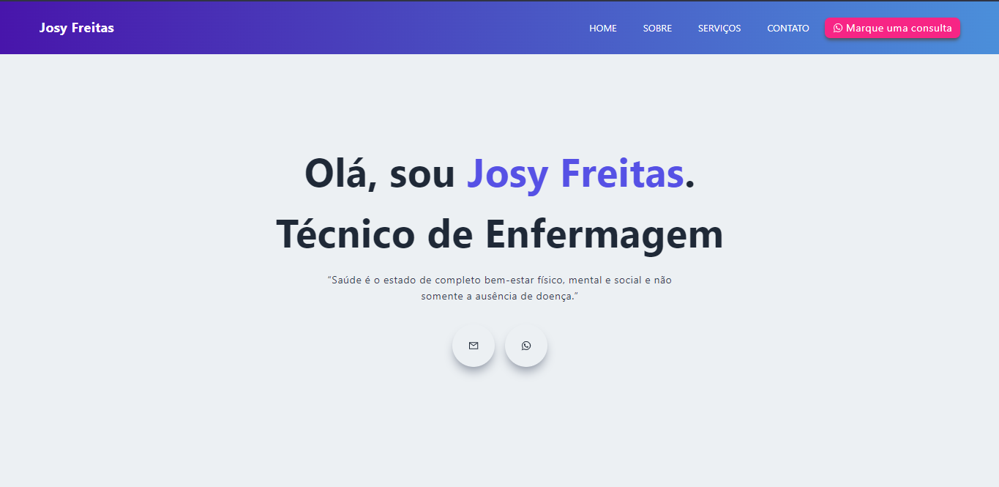
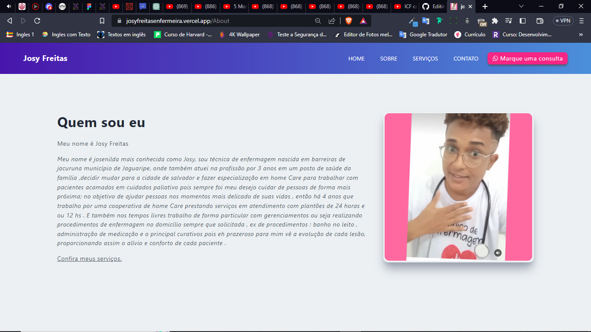
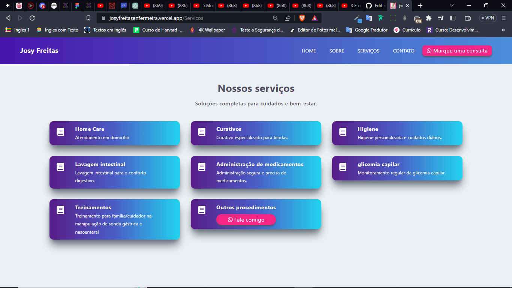
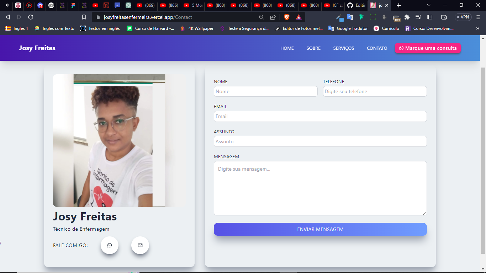
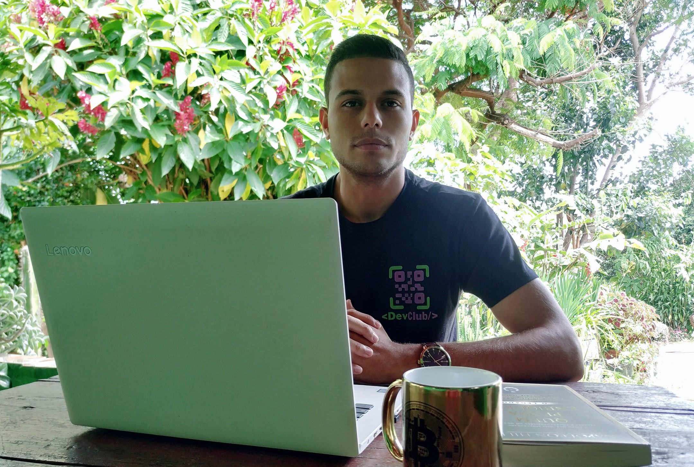

# Técnico-Enfermagem

> Página Home
 

 

> Página Sobre
 

 

> Página Serviços
 

 

> Página Contato
 

 

> <h3>Objetivo do projeto</h3>

 

O principal objetivo do projeto era solucionar um problema real enfrentado pela Josy Freitas. Com a criação da landing page, conseguimos fornecer uma solução eficaz para deixar seu trabalho mais profissional e com um alcance muito maior, tudo atendeu às suas necessidades e expectativas.

 ---
 

 

 > <h4>Principais funcionalidades:</h4>

  

 - Aparência atraente: 
   - Utilizando HTML e CSS, conseguimos criar um design visualmente atraente para a página. A combinação de cores harmoniosas, layouts responsivos e elementos bem organizados contribuiu para uma experiência agradável ao usuário.
   
   
  
 ---
 - Interatividade e dinamismo: 
   - A implementação do JavaScript permitiu adicionar recursos interativos à landing page. Elementos como botões de chamada para ação (CTAs), animações suaves e transições de página deram vida ao site, envolvendo os visitantes e incentivando a interação.
   
   
  
 ---
  - Melhoria da experiência do usuário: 
     - A utilização do ReactJS e do NextJS possibilitou a criação de uma interface de usuário mais fluida e responsiva.
     - Com o carregamento rápido das páginas e a renderização do lado do servidor (SSR), conseguimos otimizar a experiência do usuário, garantindo uma navegação suave.
    
   
  
 ---
 <h2>Colaboração e trabalho em equipe:</h2>

  

<table>
  <tr>
      <td align="center">
          <a href="#">
                 
                
                <b>Isaque Batista</b>
                
         </a>
      </td>
            <td align="center">
          <a href="https://github.com/RonaldoNascimentoSantos">
                 
                
                <b>Ronaldo Nascimento</b>
                
         </a>
      </td>
  </tr>
</table>

  
